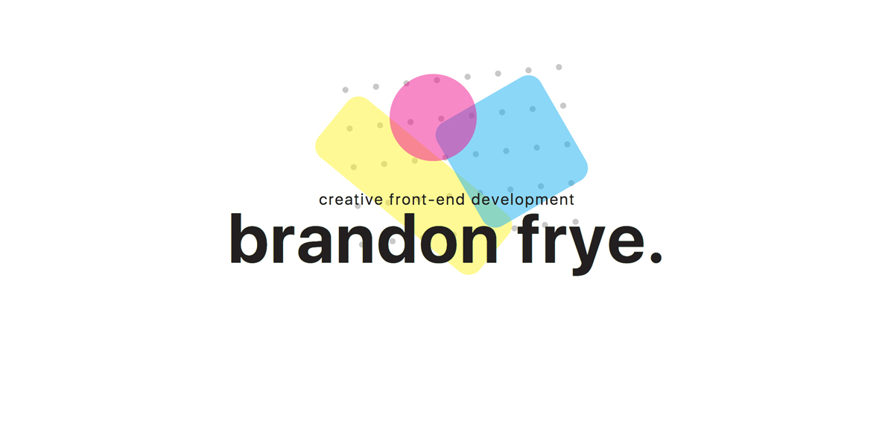

# brandonfrye.io

## Built With
- [Yarn](https://yarnpkg.com/en/)
- [PostCSS](http://postcss.org/)
- [Create React App](https://github.com/facebookincubator/create-react-app)
- [Express](https://expressjs.com)
- [GSAP](https://greensock.com/gsap)

## Deployed With
- [Heroku](https://www.heroku.com)
- [Cloudflare](https://www.cloudflare.com) for SSL

## TODO
- [ ] Add detailed content
- [ ] Clean up file architecture
- [ ] Add 404 page
- [ ] Add event tracking to Google Analytics
- [x] Include resume
- [ ] Setup SSR to inject updated HTML into static `index.html`
- [x] Add robots.txt to site

### Notes
This site was intended to help me explore building a basic site with React. Feel free to send a PR with improvements!
